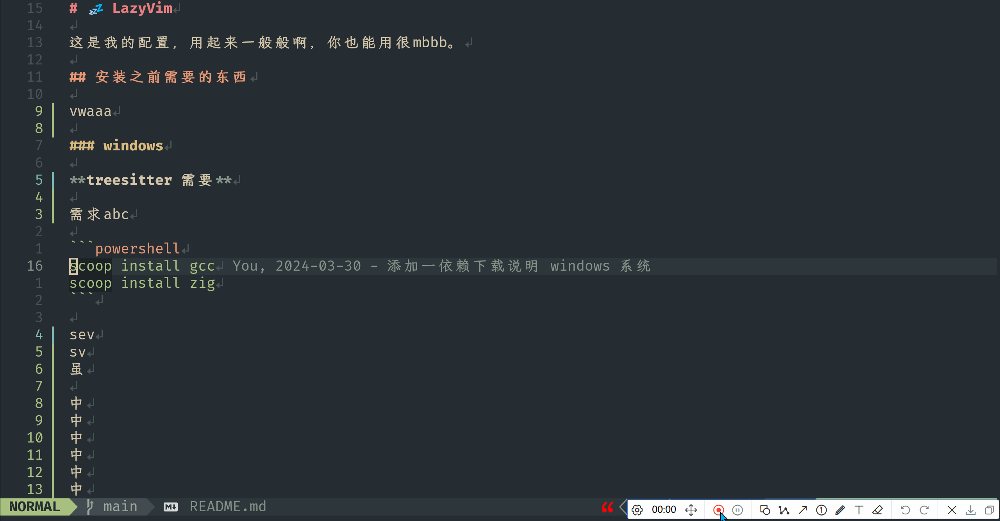

# flash-zhh.nvim

## 为什么叫 zhh.nvim

zhh 在虎码中打出来是虎！所以叫 **zhh.nvim**

基于[flash.nvim](https://github.com/folke/flash.nvim) 和 [虎码](https://tiger-code.com/)，neovim 中文跳转插件。




## 安装

- 依赖于[flash.nvim](https://github.com/folke/flash.nvim)
- 使用 [lazy.nvim](https://github.com/{folke/lazy.nvim) 进行安装:

```lua
return {
	{
		"Leiyi548/flash-zhh.nvim",
		event = "VeryLazy",
		dependencies = {
      -- 一定要用我这个 fork 的 flash
      "Leiyi548/flash.nvim",
      -- 不是必须,当你需要调试这个插件,可以启用,然后把 log.debug 注释取消
      -- "nvim-lua/plenary.nvim"
    },
		keys = {
			{
				"s",
				mode = { "n", "x" },
				function()
					require("flash-zhh").jump()
				end,
				desc = "Flash between Chinese",
			},
			{
				"r",
				mode = {  "o" },
				function()
					require("flash-zhh").jump()
				end,
				desc = "Flash between Chinese",
			},
		},
	},
	{
		"folke/flash.nvim",
		event = "VeryLazy",
		opts = {
			highlight = {
				backdrop = false,
				matches = false,
			},
		},
    }
}
```

## 使用

跟 flash 一样使用，中英文混合搜索

## 缺点

- 只能搜索一个字，不能连续搜索。（用这个的，我希望是虎码打单）

## 感谢

- [hop-zh-by-flypy](https://github.com/zzhirong/hop-zh-by-flypy)
- [flash-zh.nvim](https://github.com/rain-zm/flash-zh)

## 推荐输入法

- [cmp_im_zhh](https://github.com/Leiyi548/cmp_im_zhh) 通过补全的方式输入中文（虎码用户狂喜）
